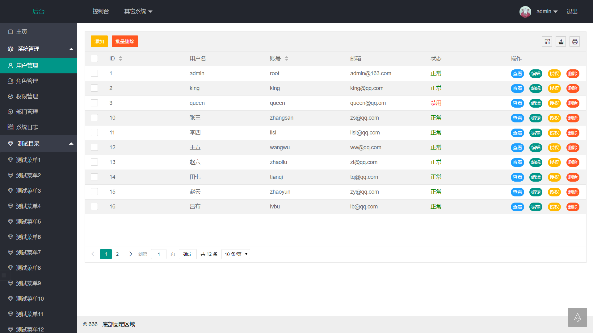
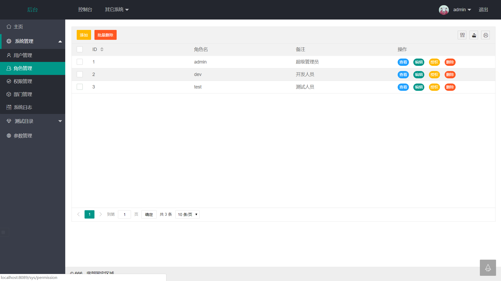
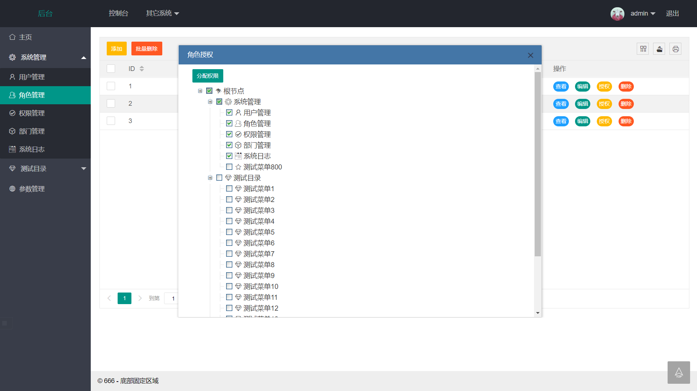
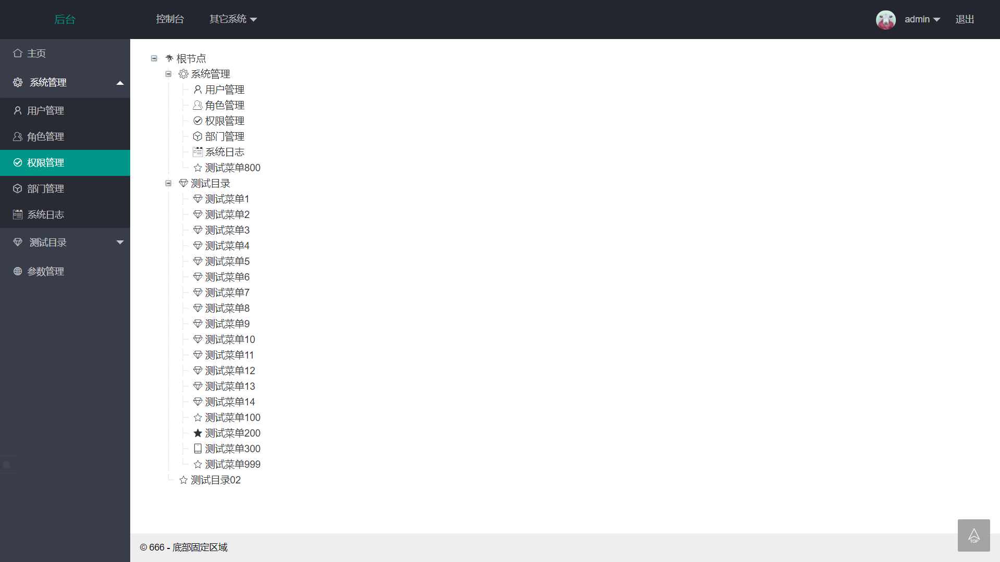
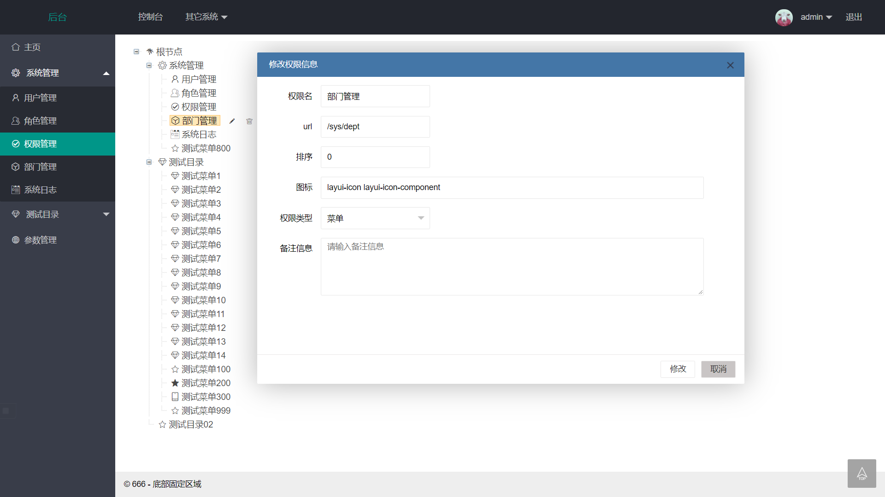

# Rbac-Permission-Management 

### 本地部署账号密码

|     账号        |         密码                  |权限                      |
|----------------|-------------------------------|-----------------------------|
|root            |               root            |超级管理员拥有所有增删改查的权限        

### 系统模块
系统功能模块组成如下所示

  

	   ├─系统管理
	   │  ├─用户管理
	   │  ├─角色管理
	   │  ├─菜单管理
	   │  └─部门管理
	 

## 技术选型
- SpringBoot 2.x
- MyBatis 3.x
- thymeleaf 2.x
- jQuery 3.x
- ztree 3.x
- lay ui 2.x

## 开发环境
- mysql8
- IDEA 2019.1.2
- JDK11
- Maven3

## 小组成员: 
- 王成君
- 李文仙
- 王经励
- 黄玮琪
- 林广博

## 成员贡献: 
- 王成君: 权限管理, 角色管理模块的开发, 数据库的设计;
- 李文仙, 黄玮琪: 负责所有前端代码的编写.
- 林广博, 王经励: 部门管理模块开发, 接口测试

### 注意:
本权限管理系统未用任何安全框架. 创建数据表使用了RBAC权限模型. 本系统只编写了和权限相关的主要功能, 还有很多其他功能将在后续版本陆续进行完善 

### 系统截图

希望老师喜欢我们的文档  给我们高分  老师万岁  耶耶耶耶耶！
